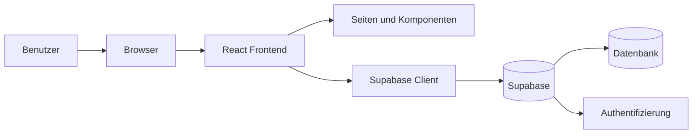

# Systemarchitektur

## Ueberblick

Die Anwendung ist eine Web-App mit React, TypeScript und Vite. Das Frontend laeuft im Browser. Daten, Anmeldung und spaetere Echtzeitfunktionen sollen ueber Supabase laufen.

## Einfache Sicht auf das System

## Hauptteile

- Benutzer arbeitet im Browser.
- Das React-Frontend zeigt Seiten, Formulare und Status an.
- Der Supabase-Client verbindet das Frontend mit dem Backend-Service.
- Supabase speichert Daten und uebernimmt spaeter die Anmeldung.

## Zentrale Designentscheidungen

- React mit TypeScript fuer klare Komponenten und gut wartbaren Code
- Vite fuer schnellen Start und einfachen Build
- Supabase, damit Auth und Datenhaltung nicht selbst gebaut werden muessen
- Erst ein einfacher End-to-End-Flow, danach schrittweiser Ausbau

## Aktuelle Projektstruktur

- `src/pages`: Seiten wie Dashboard, Devices und Simulator
- `src/components`: wiederverwendbare Bausteine wie die Navigation
- `src/config`: technische Konfiguration wie der Supabase-Client
- `public`: statische Dateien

## Ausbau im Projekt

- Login und Rollenmodell
- Verwaltung von Raeumen und Geraeten
- manuelle Steuerung und Statusanzeige
- Aktivitaetslog, Regeln und Zeitplaene
- Energie-Dashboard und Simulator

## Build und Qualitaet

- Paketverwaltung: npm
- Build: `npm run build`
- Statische Analyse: `npm run lint`
- CI: GitHub Actions fuehrt Lint und Build auf Push und Pull Request aus
