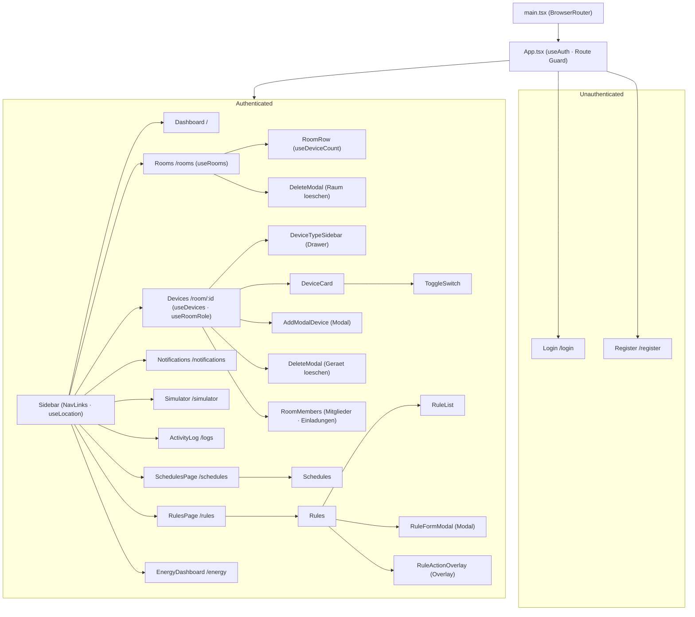
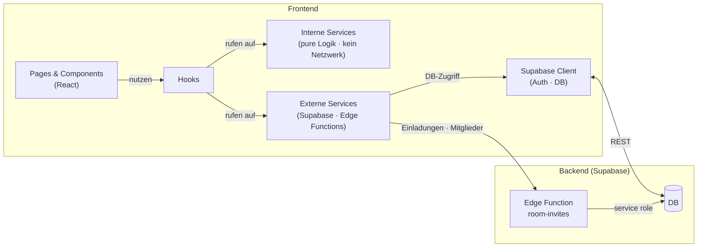
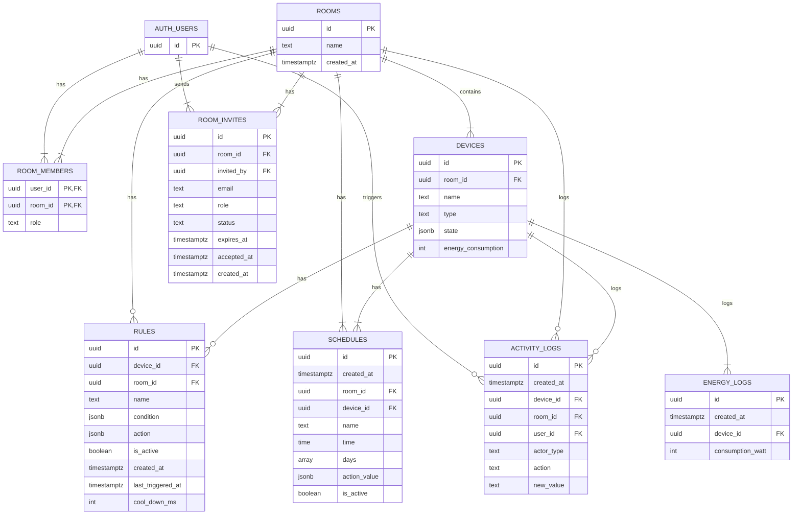
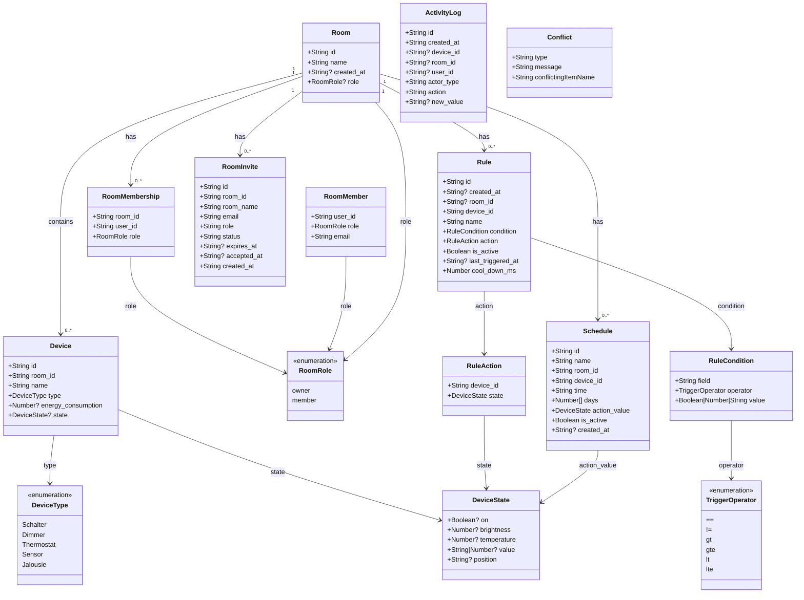

# Smart Home Orchestrator — UML Diagrams

## 1. Component Tree

```mermaid
graph TD
    main["main.tsx (BrowserRouter)"]
    App["App.tsx (useAuth · Route Guard)"]

    subgraph Unauthenticated
        Login["Login /login"]
        Register["Register /register"]
    end

    subgraph Authenticated
        Sidebar["Sidebar (NavLinks · useLocation)"]
        Dashboard["Dashboard /"]
        Rooms["Rooms /rooms (useRooms)"]
        RoomRow["RoomRow (useDeviceCount)"]
        Devices["Devices /room/:id (useDevices · useRoomRole)"]
        Notifications["Notifications /notifications"]
        Simulator["Simulator /simulator"]
        ActivityLog["ActivityLog /logs"]
        SchedulesPage["SchedulesPage /schedules"]
        RulesPage["RulesPage /rules"]
        EnergyDashboard["EnergyDashboard /energy"]
        DeviceTypeSidebar["DeviceTypeSidebar (Drawer)"]
        DeviceCard["DeviceCard"]
        ToggleSwitch["ToggleSwitch"]
        AddModalDevice["AddModalDevice (Modal)"]
        DeleteModalDevices["DeleteModal (Geraet loeschen)"]
        DeleteModalRooms["DeleteModal (Raum loeschen)"]
        RoomMembers["RoomMembers (Mitglieder · Einladungen)"]
        Schedules["Schedules"]
        Rules["Rules"]
        RuleList["RuleList"]
        RuleFormModal["RuleFormModal (Modal)"]
        RuleActionOverlay["RuleActionOverlay (Overlay)"]
    end

    main --> App
    App --> Login
    App --> Register
    App --> Authenticated

    Sidebar --> Dashboard
    Sidebar --> Rooms
    Sidebar --> Devices
    Sidebar --> Notifications
    Sidebar --> Simulator
    Sidebar --> ActivityLog
    Sidebar --> SchedulesPage
    Sidebar --> RulesPage
    Sidebar --> EnergyDashboard

    Rooms --> RoomRow
    Rooms --> DeleteModalRooms

    Devices --> DeviceTypeSidebar
    Devices --> DeviceCard
    Devices --> AddModalDevice
    Devices --> DeleteModalDevices
    Devices --> RoomMembers
    DeviceCard --> ToggleSwitch

    SchedulesPage --> Schedules
    RulesPage --> Rules
    Rules --> RuleList
    Rules --> RuleFormModal
    Rules --> RuleActionOverlay
```

---

## 2. Service & Data Flow

```mermaid
graph LR
    subgraph Frontend["Frontend"]
        pages["Pages & Components\n(React)"]
        hooks["Hooks"]
        intSvc["Interne Services\n(pure Logik · kein Netzwerk)"]
        extSvc["Externe Services\n(Supabase · Edge Functions)"]
        supabaseClient["Supabase Client\n(Auth · DB)"]
    end

    subgraph Backend["Backend (Supabase)"]
        edgeFn["Edge Function\nroom-invites"]
        db[("DB")]
    end

    pages -->|"nutzen"| hooks
    hooks -->|"rufen auf"| intSvc
    hooks -->|"rufen auf"| extSvc
    extSvc -->|"DB-Zugriff"| supabaseClient
    extSvc -->|"Einladungen · Mitglieder"| edgeFn
    supabaseClient <-->|"REST"| db
    edgeFn -->|"service role"| db
```

---

## 3. Datenbankschema (Supabase)

```mermaid
erDiagram
    ROOMS {
        uuid id PK
        text name
        timestamptz created_at
    }

    ROOM_MEMBERS {
        uuid user_id PK,FK
        uuid room_id PK,FK
        text role
    }

    DEVICES {
        uuid id PK
        uuid room_id FK
        text name
        text type
        jsonb state
        int energy_consumption
    }

    RULES {
        uuid id PK
        uuid device_id FK
        uuid room_id FK
        text name
        jsonb condition
        jsonb action
        boolean is_active
        timestamptz created_at
        timestamptz last_triggered_at
        int cool_down_ms
    }

    SCHEDULES {
        uuid id PK
        timestamptz created_at
        uuid room_id FK
        uuid device_id FK
        text name
        time time
        array days
        jsonb action_value
        boolean is_active
    }

    ROOM_INVITES {
        uuid id PK
        uuid room_id FK
        uuid invited_by FK
        text email
        text role
        text status
        timestamptz expires_at
        timestamptz accepted_at
        timestamptz created_at
    }

    ACTIVITY_LOGS {
        uuid id PK
        timestamptz created_at
        uuid device_id FK
        uuid room_id FK
        uuid user_id FK
        text actor_type
        text action
        text new_value
    }

    ENERGY_LOGS {
        uuid id PK
        timestamptz created_at
        uuid device_id FK
        int consumption_watt
    }

    AUTH_USERS {
        uuid id PK
    }

    AUTH_USERS ||--|{ ROOM_MEMBERS : "has"
    AUTH_USERS ||--|{ ROOM_INVITES : "sends"
    AUTH_USERS ||--o{ ACTIVITY_LOGS : "triggers"
    ROOMS ||--|{ ROOM_MEMBERS : "has"
    ROOMS ||--|{ DEVICES : "contains"
    ROOMS ||--|{ ROOM_INVITES : "has"
    ROOMS ||--o{ RULES : "has"
    ROOMS ||--|{ SCHEDULES : "has"
    ROOMS ||--o{ ACTIVITY_LOGS : "logs"
    DEVICES ||--o{ RULES : "has"
    DEVICES ||--|{ SCHEDULES : "has"
    DEVICES ||--o{ ACTIVITY_LOGS : "logs"
    DEVICES ||--|{ ENERGY_LOGS : "logs"
```
---

## 4. Data Model

```mermaid
classDiagram
    class Room {
        +String id
        +String name
        +String? created_at
        +RoomRole? role
    }

    class Device {
        +String id
        +String room_id
        +String name
        +DeviceType type
        +Number? energy_consumption
        +DeviceState? state
    }

    class DeviceType {
        <<enumeration>>
        Schalter
        Dimmer
        Thermostat
        Sensor
        Jalousie
    }

    class DeviceState {
        +Boolean? on
        +Number? brightness
        +Number? temperature
        +String|Number? value
        +String? position
    }

    class RoomRole {
        <<enumeration>>
        owner
        member
    }

    class RoomMembership {
        +String room_id
        +String user_id
        +RoomRole role
    }

    class RoomMember {
        +String user_id
        +RoomRole role
        +String email
    }

    class RoomInvite {
        +String id
        +String room_id
        +String room_name
        +String email
        +String role
        +String status
        +String? expires_at
        +String? accepted_at
        +String created_at
    }

    class ActivityLog {
        +String id
        +String created_at
        +String? device_id
        +String? room_id
        +String? user_id
        +String actor_type
        +String action
        +String? new_value
    }

    class TriggerOperator {
        <<enumeration>>
        ==
        !=
        gt
        gte
        lt
        lte
    }

    class RuleCondition {
        +String field
        +TriggerOperator operator
        +Boolean|Number|String value
    }

    class RuleAction {
        +String device_id
        +DeviceState state
    }

    class Rule {
        +String id
        +String? created_at
        +String? room_id
        +String device_id
        +String name
        +RuleCondition condition
        +RuleAction action
        +Boolean is_active
        +String? last_triggered_at
        +Number cool_down_ms
    }

    class Schedule {
        +String id
        +String name
        +String room_id
        +String device_id
        +String time
        +Number[] days
        +DeviceState action_value
        +Boolean is_active
        +String? created_at
    }

    class Conflict {
        +String type
        +String message
        +String conflictingItemName
    }

    Room "1" --> "0..*" Device : contains
    Room "1" --> "0..*" RoomMembership : has
    Room "1" --> "0..*" RoomInvite : has
    Room "1" --> "0..*" Rule : has
    Room "1" --> "0..*" Schedule : has
    RoomMembership --> RoomRole : role
    RoomMember --> RoomRole : role
    Room --> RoomRole : role
    Device --> DeviceType : type
    Device --> DeviceState : state
    Rule --> RuleCondition : condition
    Rule --> RuleAction : action
    RuleAction --> DeviceState : state
    RuleCondition --> TriggerOperator : operator
    Schedule --> DeviceState : action_value
```

