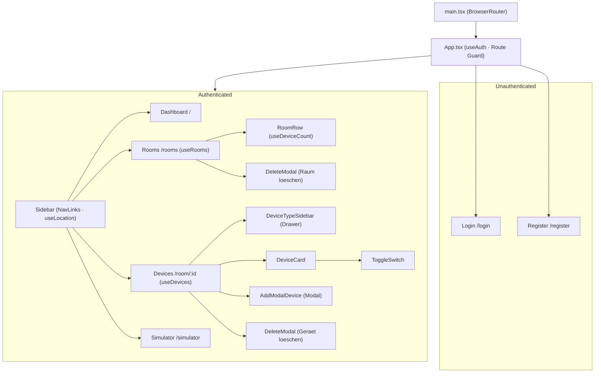
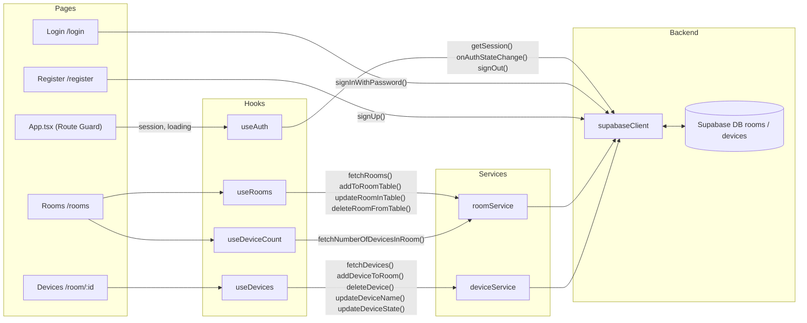
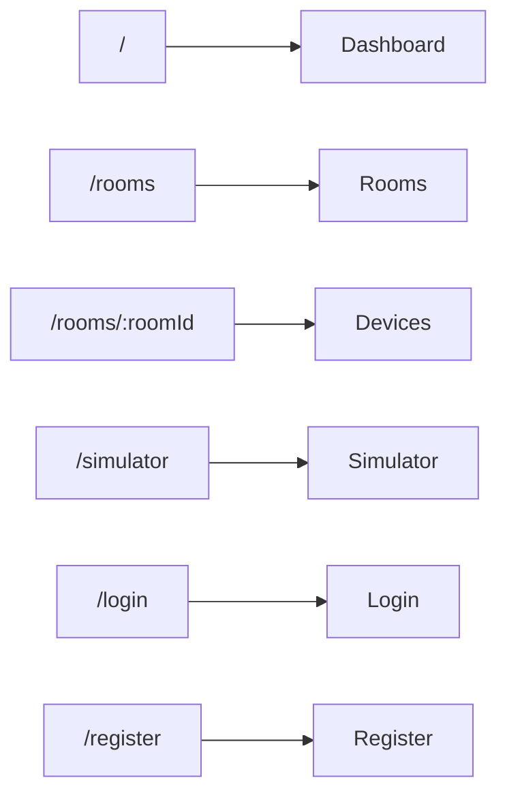
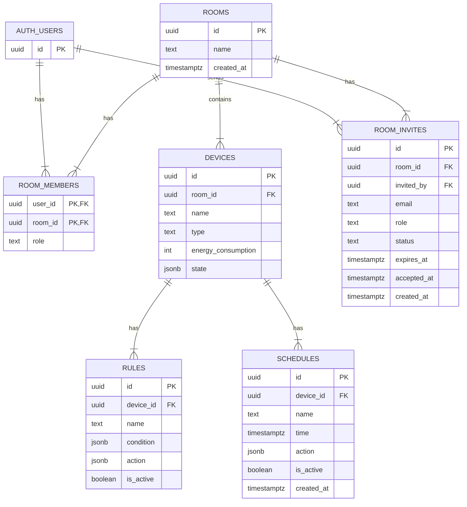
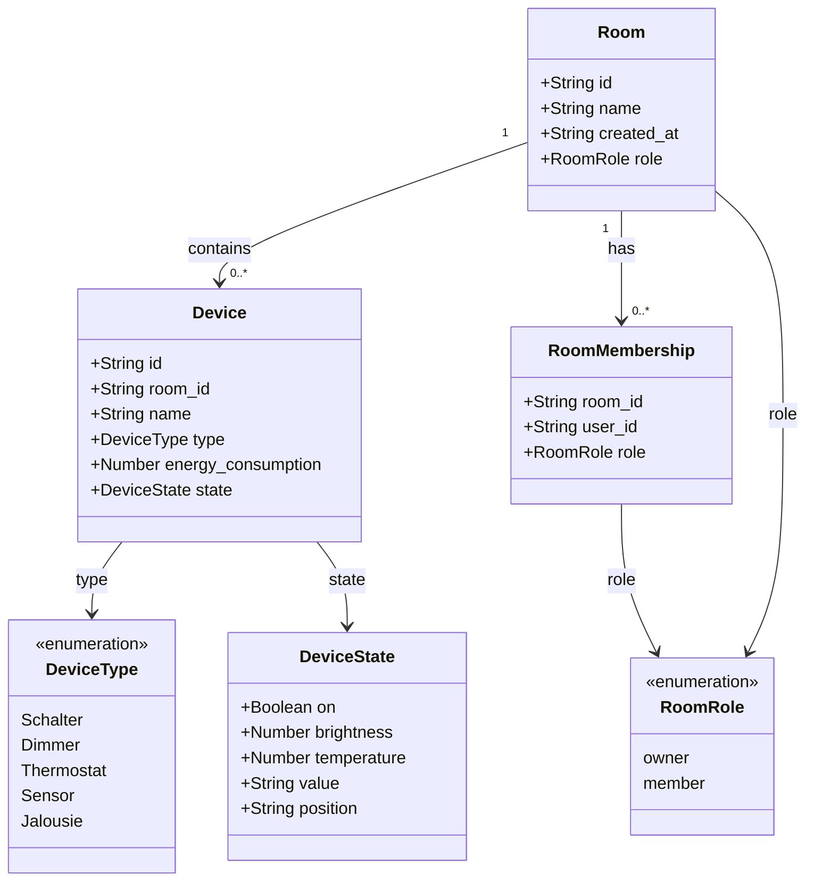

# Smart Home Orchestrator — UML Diagrams

## 1. Component Tree

```mermaid
graph TD
    main["main.tsx (BrowserRouter)"]
    App["App.tsx (useAuth · Route Guard)"]

    subgraph Unauthenticated
        Login["Login /login"]
        Register["Register /register"]
    end

    subgraph Authenticated
        Sidebar["Sidebar (NavLinks · useLocation)"]
        Dashboard["Dashboard /"]
        Rooms["Rooms /rooms (useRooms)"]
        RoomRow["RoomRow (useDeviceCount)"]
        Devices["Devices /room/:id (useDevices)"]
        Simulator["Simulator /simulator"]
        DeviceTypeSidebar["DeviceTypeSidebar (Drawer)"]
        DeviceCard["DeviceCard"]
        ToggleSwitch["ToggleSwitch"]
        AddModalDevice["AddModalDevice (Modal)"]
        DeleteModalDevices["DeleteModal (Geraet loeschen)"]
        DeleteModalRooms["DeleteModal (Raum loeschen)"]
    end

    main --> App
    App --> Login
    App --> Register
    App --> Authenticated

    Sidebar --> Dashboard
    Sidebar --> Rooms
    Sidebar --> Devices
    Sidebar --> Simulator

    Rooms --> RoomRow
    Rooms --> DeleteModalRooms

    Devices --> DeviceTypeSidebar
    Devices --> DeviceCard
    Devices --> AddModalDevice
    Devices --> DeleteModalDevices
    DeviceCard --> ToggleSwitch
```

---

## 2. Service & Data Flow

```mermaid
graph LR
    subgraph Pages
        App["App.tsx (Route Guard)"]
        Login["Login /login"]
        Register["Register /register"]
        Rooms["Rooms /rooms"]
        Devices["Devices /room/:id"]
    end

    subgraph Hooks
        useAuth["useAuth"]
        useRooms["useRooms"]
        useDeviceCount["useDeviceCount"]
        useDevices["useDevices"]
    end

    subgraph Services
        roomSvc["roomService"]
        deviceSvc["deviceService"]
    end

    subgraph Backend
        supabase["supabaseClient"]
        db[("Supabase DB rooms / devices")]
    end

    App -->|"session, loading"| useAuth
    Rooms --> useRooms
    Rooms --> useDeviceCount
    Devices --> useDevices

    useAuth -->|"getSession() onAuthStateChange() signOut()"| supabase
    Login -->|"signInWithPassword()"| supabase
    Register -->|"signUp()"| supabase

    useRooms -->|"fetchRooms() addToRoomTable() updateRoomInTable() deleteRoomFromTable()"| roomSvc
    useDeviceCount -->|"fetchNumberOfDevicesInRoom()"| roomSvc
    useDevices -->|"fetchDevices() addDeviceToRoom() deleteDevice() updateDeviceName() updateDeviceState()"| deviceSvc

    roomSvc --> supabase
    deviceSvc --> supabase
    supabase <--> db
```

---

## 3. Routing

```mermaid
graph LR
    root["/"] --> Dashboard
    rooms["/rooms"] --> Rooms
    roomId["/rooms/:roomId"] --> Devices
    sim["/simulator"] --> Simulator
    login["/login"] --> Login
    register["/register"] --> Register
```
---

## 4. Datenbankschema (Supabase)

```mermaid
erDiagram
    ROOMS {
        uuid id PK
        text name
        timestamptz created_at
    }

    ROOM_MEMBERS {
        uuid user_id PK,FK
        uuid room_id PK,FK
        text role
    }

    DEVICES {
        uuid id PK
        uuid room_id FK
        text name
        text type
        int energy_consumption
        jsonb state
    }

    RULES {
        uuid id PK
        uuid device_id FK
        text name
        jsonb condition
        jsonb action
        boolean is_active
    }

    SCHEDULES {
        uuid id PK
        uuid device_id FK
        text name
        timestamptz time
        jsonb action
        boolean is_active
        timestamptz created_at
    }

    ROOM_INVITES {
        uuid id PK
        uuid room_id FK
        uuid invited_by FK
        text email
        text role
        text status
        timestamptz expires_at
        timestamptz accepted_at
        timestamptz created_at
    }

    AUTH_USERS {
        uuid id PK
    }

    AUTH_USERS ||--|{ ROOM_MEMBERS : "has"
    AUTH_USERS ||--|{ ROOM_INVITES : "sends"
    ROOMS ||--|{ ROOM_MEMBERS : "has"
    ROOMS ||--|{ DEVICES : "contains"
    ROOMS ||--|{ ROOM_INVITES : "has"
    DEVICES ||--|{ RULES : "has"
    DEVICES ||--|{ SCHEDULES : "has"
```
---

## 5. Data Model

```mermaid
classDiagram
    class Room {
        +String id
        +String name
        +String created_at
        +RoomRole role
    }

    class Device {
        +String id
        +String room_id
        +String name
        +DeviceType type
        +Number energy_consumption
        +DeviceState state
    }

    class DeviceType {
        <<enumeration>>
        Schalter
        Dimmer
        Thermostat
        Sensor
        Jalousie
    }

    class DeviceState {
        +Boolean on
        +Number brightness
        +Number temperature
        +String value
        +String position
    }

    class RoomRole {
        <<enumeration>>
        owner
        member
    }

    class RoomMembership {
        +String room_id
        +String user_id
        +RoomRole role
    }

    Room "1" --> "0..*" Device : contains
    Room "1" --> "0..*" RoomMembership : has
    RoomMembership --> RoomRole : role
    Room --> RoomRole : role
    Device --> DeviceType : type
    Device --> DeviceState : state
```

