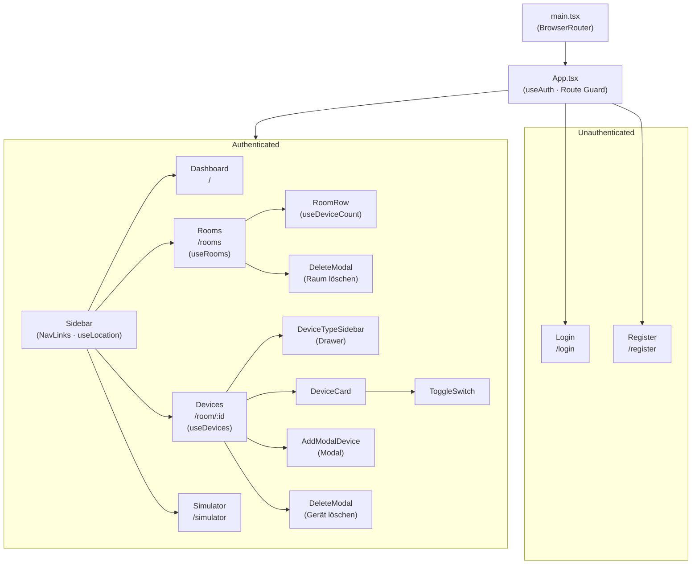
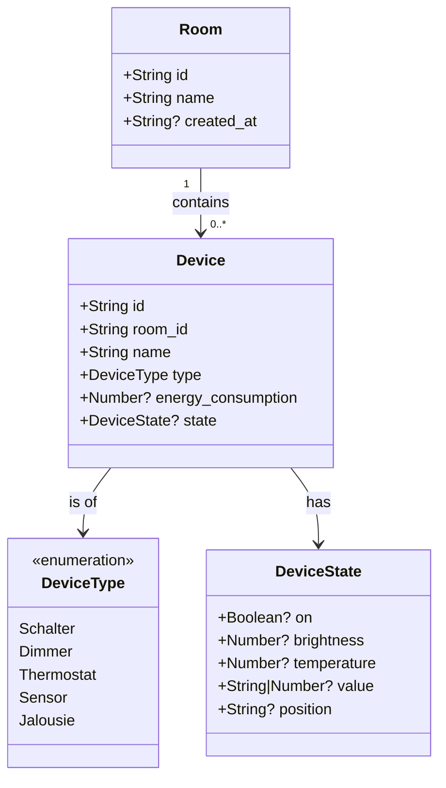
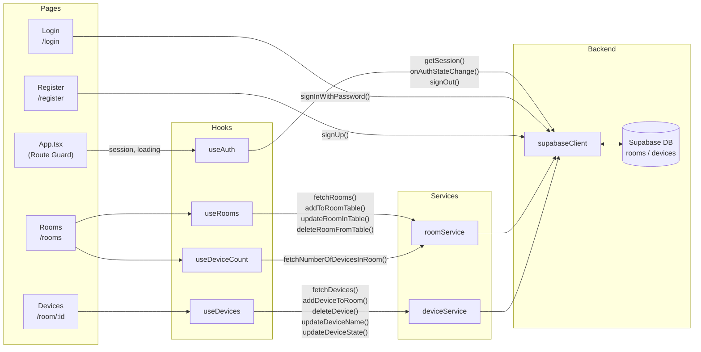
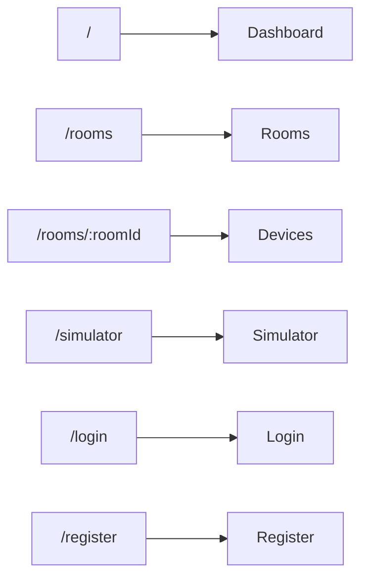

# Smart Home Orchestrator — UML Diagrams

## 1. Component Tree

```mermaid
graph TD
    main["main.tsx\n(BrowserRouter)"]
    App["App.tsx\n(useAuth · Route Guard)"]

    subgraph Unauthenticated
        Login["Login\n/login"]
        Register["Register\n/register"]
    end

    subgraph Authenticated
        Sidebar["Sidebar\n(NavLinks · useLocation)"]
        Dashboard["Dashboard\n/"]
        Rooms["Rooms\n/rooms\n(useRooms)"]
        RoomRow["RoomRow\n(useDeviceCount)"]
        Devices["Devices\n/room/:id\n(useDevices)"]
        Simulator["Simulator\n/simulator"]
        DeviceTypeSidebar["DeviceTypeSidebar\n(Drawer)"]
        DeviceCard["DeviceCard"]
        ToggleSwitch["ToggleSwitch"]
        AddModalDevice["AddModalDevice\n(Modal)"]
        DeleteModalDevices["DeleteModal\n(Gerät löschen)"]
        DeleteModalRooms["DeleteModal\n(Raum löschen)"]
    end

    main --> App
    App --> Login
    App --> Register
    App --> Authenticated

    Sidebar --> Dashboard
    Sidebar --> Rooms
    Sidebar --> Devices
    Sidebar --> Simulator

    Rooms --> RoomRow
    Rooms --> DeleteModalRooms

    Devices --> DeviceTypeSidebar
    Devices --> DeviceCard
    Devices --> AddModalDevice
    Devices --> DeleteModalDevices
    DeviceCard --> ToggleSwitch
```

---

## 2. Data Model

```mermaid
classDiagram
    class Room {
        +String id
        +String name
        +String? created_at
    }

    class Device {
        +String id
        +String room_id
        +String name
        +DeviceType type
        +Number? energy_consumption
        +DeviceState? state
    }

    class DeviceType {
        <<enumeration>>
        Schalter
        Dimmer
        Thermostat
        Sensor
        Jalousie
    }

    class DeviceState {
        +Boolean? on
        +Number? brightness
        +Number? temperature
        +String|Number? value
        +String? position
    }

    Room "1" --> "0..*" Device : contains
    Device --> DeviceType : is of
    Device --> DeviceState : has
```

---

## 3. Service & Data Flow

```mermaid
graph LR
    subgraph Pages
        App["App.tsx\n(Route Guard)"]
        Login["Login\n/login"]
        Register["Register\n/register"]
        Rooms["Rooms\n/rooms"]
        Devices["Devices\n/room/:id"]
    end

    subgraph Hooks
        useAuth["useAuth"]
        useRooms["useRooms"]
        useDeviceCount["useDeviceCount"]
        useDevices["useDevices"]
    end

    subgraph Services
        roomSvc["roomService"]
        deviceSvc["deviceService"]
    end

    subgraph Backend
        supabase["supabaseClient"]
        db[("Supabase DB\nrooms / devices")]
    end

    App -->|"session, loading"| useAuth
    Rooms --> useRooms
    Rooms --> useDeviceCount
    Devices --> useDevices

    useAuth -->|"getSession()\nonAuthStateChange()\nsignOut()"| supabase
    Login -->|"signInWithPassword()"| supabase
    Register -->|"signUp()"| supabase

    useRooms -->|"fetchRooms()\naddToRoomTable()\nupdateRoomInTable()\ndeleteRoomFromTable()"| roomSvc
    useDeviceCount -->|"fetchNumberOfDevicesInRoom()"| roomSvc
    useDevices -->|"fetchDevices()\naddDeviceToRoom()\ndeleteDevice()\nupdateDeviceName()\nupdateDeviceState()"| deviceSvc

    roomSvc --> supabase
    deviceSvc --> supabase
    supabase <--> db
```

---

## 4. Routing

```mermaid
graph LR
    root["/"] --> Dashboard
    rooms["/rooms"] --> Rooms
    roomId["/rooms/:roomId"] --> Devices
    sim["/simulator"] --> Simulator
    login["/login"] --> Login
    register["/register"] --> Register
```

---
