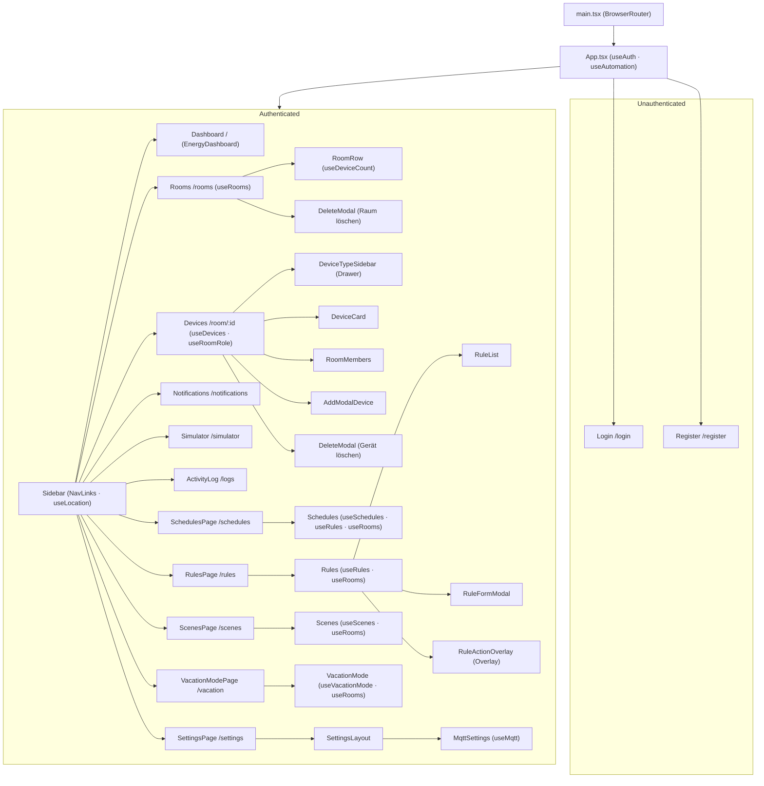
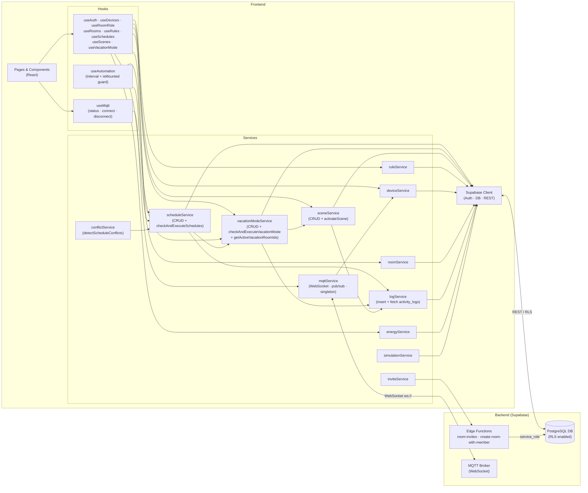
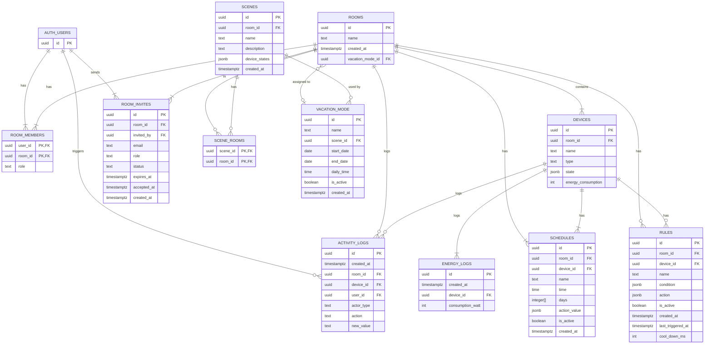
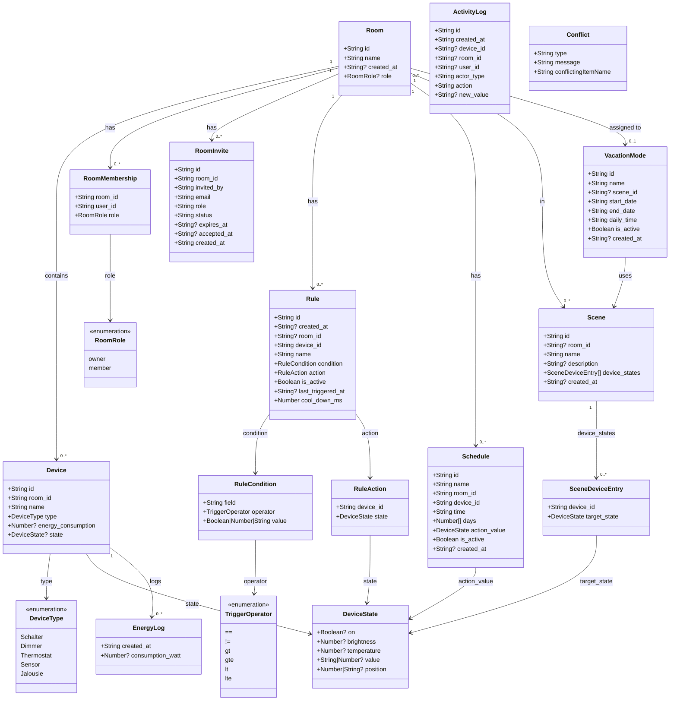
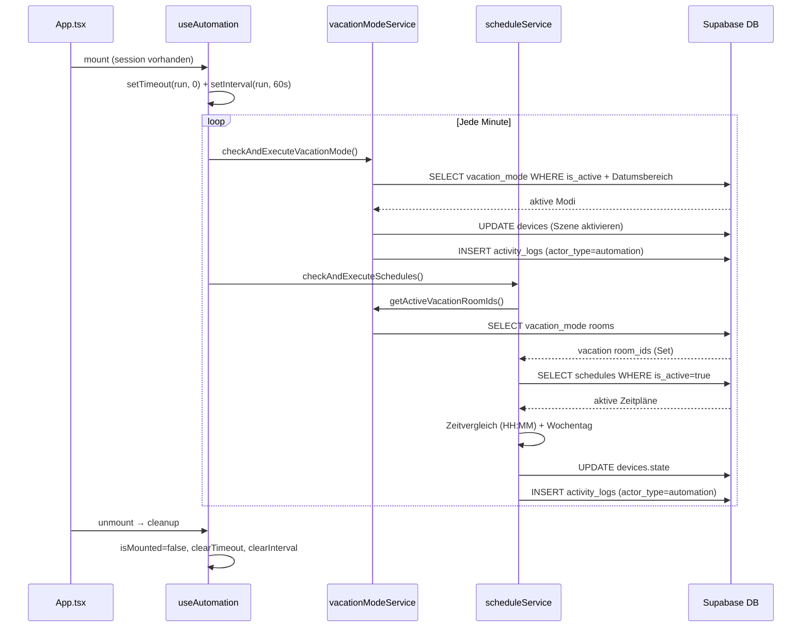

# Smart Home Orchestrator — UML-Diagramme zur Systemarchitektur

Diese Seite enthaelt ergaenzende UML-Diagramme zur Systemarchitektur. Zur narrativen Uebersicht siehe [Systemarchitektur](./system-architecture.md).

## 1. Component Tree



---

## 2. Service & Data Flow



---

## 3. Datenbankschema (Supabase)



---

## 4. Data Model



---

## 5. Automations-Ablauf



---

## 6. Projektstruktur & SQL-Migrationen

```
src/
├── App.tsx                    # Root: Auth-Guard, Routing, useAutomation
├── main.tsx                   # BrowserRouter, StrictMode
├── types.ts                   # Gemeinsame TypeScript-Typen
├── config/
│   └── supabaseClient.ts      # Supabase-Initialisierung
├── hooks/
│   ├── useAutomation.ts       # Zentraler Automations-Timer (Zeitpläne + Urlaubsmodus)
│   ├── useAuth.ts             # Session & Login-State
│   ├── useDevices.ts          # Geräteliste für einen Raum
│   ├── useMqtt.ts             # MQTT-Verbindungsstatus & Konfiguration
│   ├── useRooms.ts            # Räume + Rollen des eingeloggten Users
│   ├── useRoomRole.ts         # Rolle in einem spezifischen Raum
│   ├── useRules.ts            # Automatisierungsregeln
│   ├── useScenes.ts           # Szenen + verfügbare Geräte
│   ├── useSchedules.ts        # Zeitpläne + verfügbare Geräte
│   └── useVacationMode.ts     # Urlaubsmodi + verfügbare Szenen
├── services/
│   ├── conflictService.ts     # Konflikterkennung (Regel/Zeitplan-Überschneidungen)
│   ├── csvService.ts          # CSV-Export für Energie-Logs
│   ├── deviceService.ts       # Gerät CRUD + State-Update
│   ├── energyService.ts       # Energie-Logs lesen
│   ├── inviteService.ts       # Raum-Einladungen (ruft Edge Functions auf)
│   ├── logService.ts          # Activity-Log schreiben & lesen
│   ├── mqttService.ts         # MQTT WebSocket-Client (Singleton)
│   ├── roomService.ts         # Raum CRUD + Mitglieder
│   ├── ruleService.ts         # Regel CRUD + checkAndExecuteRules
│   ├── sceneService.ts        # Szenen CRUD + activateScene
│   ├── scheduleService.ts     # Zeitplan CRUD + checkAndExecuteSchedules
│   ├── simulationService.ts   # Simulator-Logik
│   └── vacationModeService.ts # Urlaubsmodus CRUD + checkAndExecuteVacationMode
├── pages/                     # Seitenkomponenten (1:1 zu Routen)
└── components/                # Wiederverwendbare UI-Komponenten

sql/
├── db-scheme.txt              # Basis-Schema: rooms, room_members, devices, rules, schedules
├── activitylog.txt            # activity_logs Tabelle + RLS
├── energy-dashboard.txt       # energy_logs Tabelle + RLS
├── room-invites.txt           # room_invites Tabelle + RLS
├── rules.txt                  # Erweiterung rules: room_id, last_triggered_at, cool_down_ms
├── schedules.txt              # Erweiterung schedules: room_id, days[], action_value
├── scenes.txt                 # scenes Tabelle + RLS (FR-17)
├── scenes-multi-room.sql      # Migration: scene_rooms Junction-Tabelle (1:n Räume)
├── vacation-mode.txt          # vacation_mode Tabelle + RLS (FR-21)
├── vacation-mode-v2.txt       # Migration: vacation_mode 1:n Räume via rooms.vacation_mode_id
├── fix-scene-device-states.txt# Datenmigration: device_states mit korrektem "on"-Feld
└── seed-dummy-data.txt        # Testdaten für Entwicklung

supabase/functions/
├── room-invites/              # Edge Function: Einladungs-E-Mail versenden
└── create-room-with-member/   # Edge Function: Raum + Owner-Mitgliedschaft atomisch anlegen
```

### RLS-Zugriffsmatrix

| Tabelle         | SELECT              | INSERT              | UPDATE              | DELETE              |
|-----------------|---------------------|---------------------|---------------------|---------------------|
| rooms           | Mitglieder          | via Edge Function   | Mitglieder          | Owner               |
| room_members    | eigene Zeilen       | via Edge Function   | —                   | —                   |
| devices         | Raum-Mitglieder     | Raum-Mitglieder     | Raum-Mitglieder     | Raum-Mitglieder     |
| rules           | Raum-Mitglieder     | Raum-Mitglieder     | Raum-Mitglieder     | Raum-Mitglieder     |
| schedules       | Raum-Mitglieder     | Raum-Mitglieder     | Raum-Mitglieder     | Raum-Mitglieder     |
| scenes          | Raum-Mitglieder     | Owner               | Owner               | Owner               |
| scene_rooms     | authenticated       | authenticated       | —                   | authenticated       |
| vacation_mode   | authenticated       | authenticated       | Owner des Raums     | Owner des Raums     |
| activity_logs   | Raum-Mitglieder     | authenticated       | —                   | —                   |
| energy_logs     | Raum-Mitglieder     | authenticated       | —                   | —                   |
| room_invites    | Eingeladene/Owner   | Owner               | —                   | —                   |
