# Benutzerdokumentation

## Zielgruppe

Die Anwendung richtet sich an Benutzerinnen und Benutzer, die virtuelle Smart-Home-Geräte in einer gemeinsamen Oberfläche verwalten und steuern wollen.

## Installationsanleitung

### Lokale Ausführung

1. **Voraussetzungen**
   - Node.js 22
   - npm 11
   - Zugriff auf die Supabase-Konfiguration (Umgebungsvariablen)

2. `.env.example` nach `.env` kopieren.

3. **Schritte zur Installation und Ausführung**
   1. Repository klonen oder herunterladen.
   2. Anwendung starten:
      ```bash
      npm run dev
      ```
   3. Die Anwendung ist anschließend lokal unter der ausgegebenen Adresse erreichbar, zum Beispiel `http://localhost:5173`.

4. **Hinweise zur Konfiguration**
   - Die Verbindungsdaten für Supabase müssen in der Konfiguration hinterlegt sein.
   - Die zentrale Supabase-Client-Konfiguration befindet sich im Projekt unter `src/config/supabaseClient.ts`.
   - Für produktive Deployments sollte zusätzlich eine passende Umgebungskonfiguration verwendet werden.

### Öffentlicher Zugriff

Die aktuelle öffentliche Version der Anwendung ist über GitHub Pages erreichbar:

- https://jku-win-se.github.io/teaching-2026.ss.prse.braeuer.team5/

Diese Seite dient als Referenz für den produktiven, öffentlich zugänglichen Stand der App.

## Gerätekompatibilität und Responsive Design

Die Anwendung ist vollständig responsive und funktioniert auf verschiedenen Geräten und Bildschirmgrößen:

- **Desktop** (> 900px): Vollständige Ansicht mit Sidebar und allen UI-Elementen
- **Tablet** (480px - 900px): Optimierte Ansicht mit angepasstem Layout
- **Mobile** (< 480px): Kompaktes Mobilgerät-Layout mit vereinfachter Bedienung

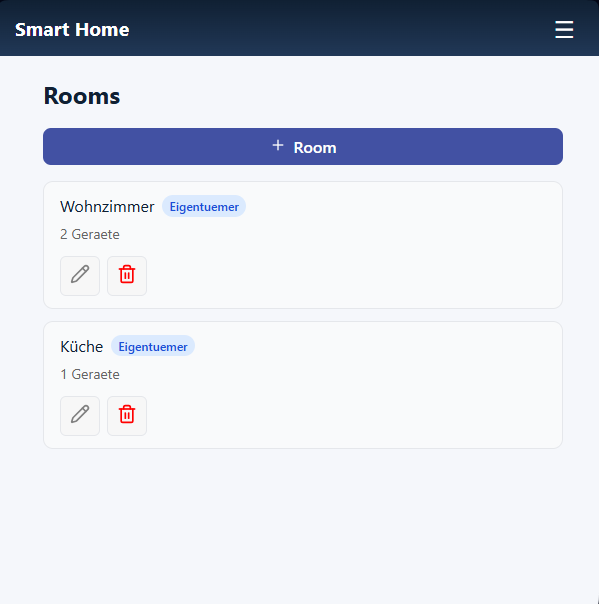

Die Anwendung passt sich automatisch an die Bildschirmgröße an und bietet auf allen Geräten eine intuitive Bedienung.

## Funktionale Beschreibung

Die Anwendung unterstützt die folgenden Kernfunktionen in Bezug auf die funktionalen Anforderungen:

### Benutzerverwaltung

#### Registrierung
Ein Benutzer kann sich mit einer eindeutigen E-Mail-Adresse und einem Passwort registrieren. ([FR-01](#fr-01))

Mit der Eingabe der E-Mail und dem Vergeben eines Passworts kann man sich bei der Anwendung registrieren. Zu beachten ist, dass nach der Registration eine Bestätigungsemail gesendet wird, um den Nutzer zu verifizieren. Erst danach ist der Login möglich.
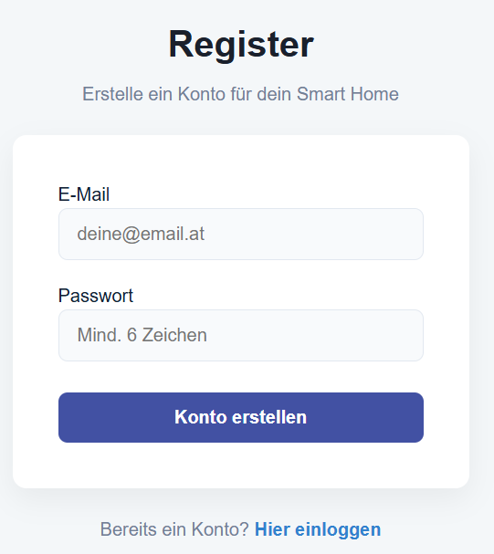

#### Login/Logout
Registrierte Benutzer können sich sicher anmelden und abmelden. ([FR-02](#fr-02))

Mit der Eingabe der E-Mail und dem zuvor vergebenen Passwort kann man sich hier nun anmelden.
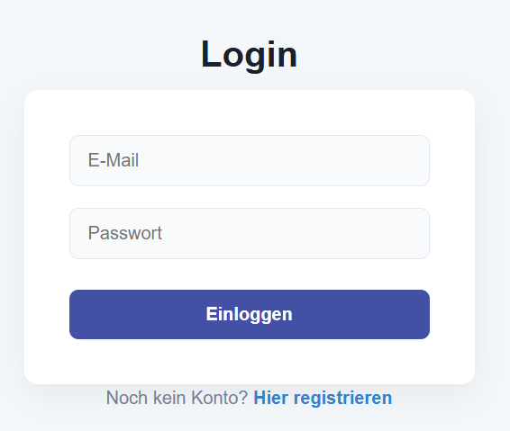

Innerhalb der Plattform kann man sich einfach per Klick auf den Button „Abmelden“ ausloggen.
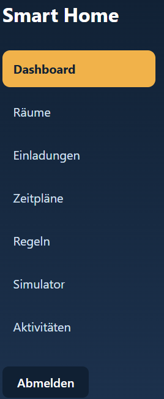

#### Rollenmodell
Die Anwendung unterscheidet zwischen Eigentümer und Mitglied. Eigentümer haben vollständigen Zugriff, Mitglieder können nur steuern. ([FR-13](#fr-13))

Bei Funktionalitäten, die von den Rollen bestimmt werden, ist zusätzlich ein Label hinterlegt, welche Rolle man zurzeit besitzt.
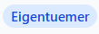

#### Einladungen & Widerruf
Eigentümer können weitere Mitglieder per E-Mail einladen und deren Zugriff widerrufen. ([FR-20](#fr-20))

In den jeweiligen Räumen können weitere Mitglieder vom Eigentümer eingeladen werden und anschließend auch wieder entfernt.
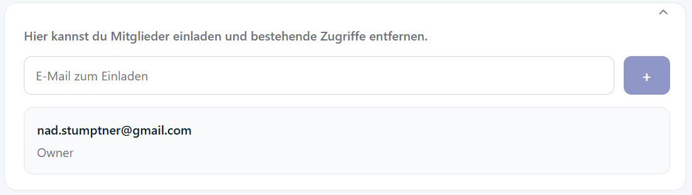

In einer eigenen Seite kann überprüft werden, ob aktuell offene Einladungen vorhanden sind.
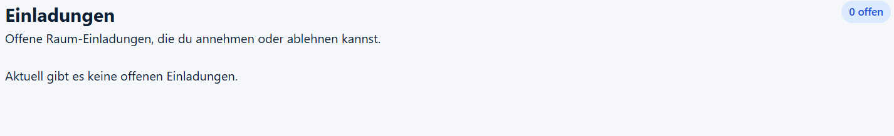

### Räume und Geräte

#### Raumverwaltung
Authentifizierte Benutzer können Räume erstellen, umbenennen und löschen. ([FR-03](#fr-03))

Auf der Seite „Räume“ kann man mittels des Buttons „+ Room“ einen Raum erstellen, indem man einfach einen Namen vergibt und anschließend speichert.
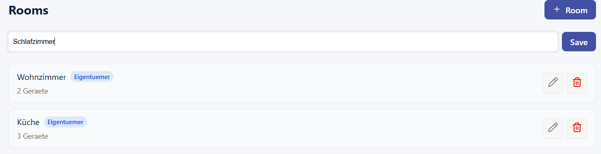

Mittels Klick auf den Stift kann der Raum umbenannt und mit Klick auf den Mülleimer gelöscht werden.
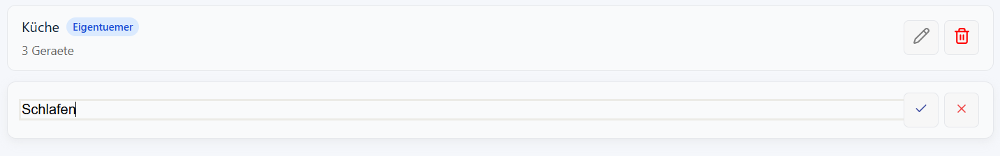

#### Geräteverwaltung
Benutzer können virtuelle Geräte hinzufügen, entfernen und umbenennen. ([FR-04](#fr-04), [FR-05](#fr-05))

Innerhalb des Raums können verschiedene Geräte (Schalter, Dimmer, Thermostat, Sensor, Jalousie) aus dem Bauteile-Panel hinzugefügt werden.
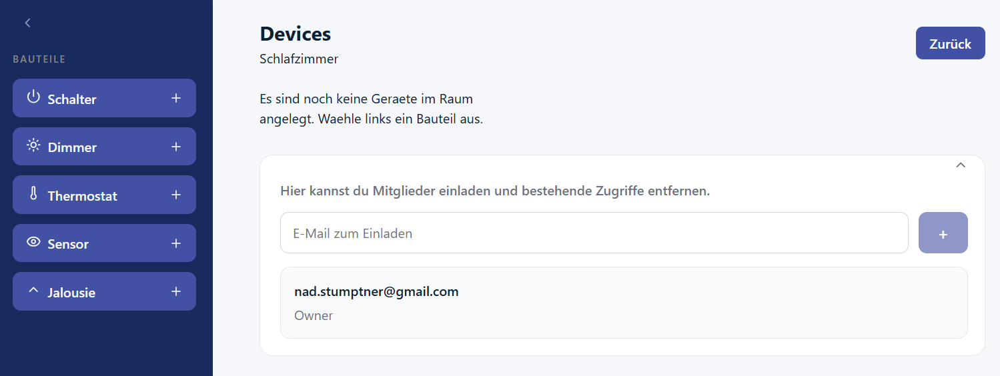

Beim Erstellen eines Geräts wird ein Name und ein durchschnittlicher Stromverbrauch vergeben, welcher später weiterverarbeitet wird.
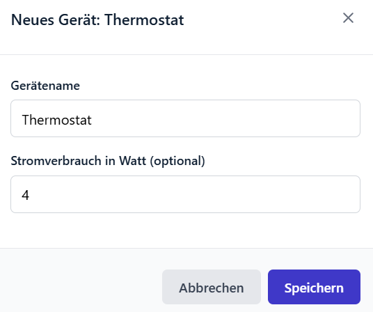

Jedes der Geräte bekommt einen Initialwert, welcher nun verändert werden kann. Wie bei den Räumen kann man die Geräte umbenennen und löschen.
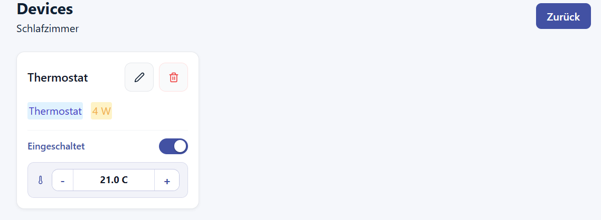

Zum Wechseln des Raums klickt man lediglich auf den Zurück-Button und kehrt zur Raumübersicht zurück.

#### Manuelle Steuerung
Geräte können aktiv gesteuert werden, zum Beispiel Schalter ein-/ausschalten, Dimmer-Helligkeit setzen, Thermostat-Solltemperatur ändern, Jalousien öffnen/schließen und Sensorspitzen eingeben. ([FR-06](#fr-06))

### Zustandsanzeige und Logging

#### Echtzeitzustände
Der aktuelle Zustand jedes Geräts wird in der Benutzeroberfläche gepflegt und angezeigt. ([FR-07](#fr-07))

#### Aktivitätslog
Jede manuelle oder automatisierte Zustandsänderung wird mit Zeitstempel, Gerät und Akteur protokolliert. ([FR-08](#fr-08))

Auf der Aktivitäten-Seite werden Zustandsänderungen mit Zeitpunkt, Objekt, Aktion, Details und Akteur mitgeschrieben, um die Nachvollziehbarkeit zu gewährleisten.
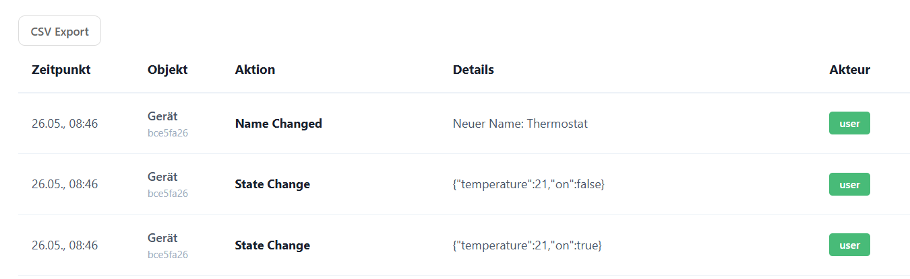

#### CSV-Export
Aktivitätslog und Energieverbrauchszusammenfassung können als CSV exportiert werden. ([FR-16](#fr-16))

Mittels Klick auf den Button „CSV Export“ kann das Aktivitätslog sowie die Daten des Energie-Dashboards exportiert werden.
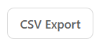

### Automatisierung

#### Zeitpläne
Benutzer können bedingungslose, wiederkehrende Zeitpläne für Geräteaktionen konfigurieren. ([FR-09](#fr-09))

Innerhalb der Zeitpläne-Seite können verschiedene Zeitpläne erstellt, bearbeitet und gelöscht werden.
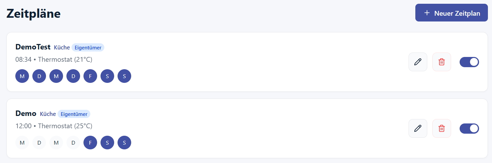

In der Erstellungsmaske vergibt man einen Namen und wählt anschließend das betroffene Gerät. Je nach Geräteart können dann entsprechende Aktionen ausgeführt werden. Zuletzt wählt man noch die Uhrzeit und an welchen Wochentagen der Zeitplan ausgeführt werden soll.
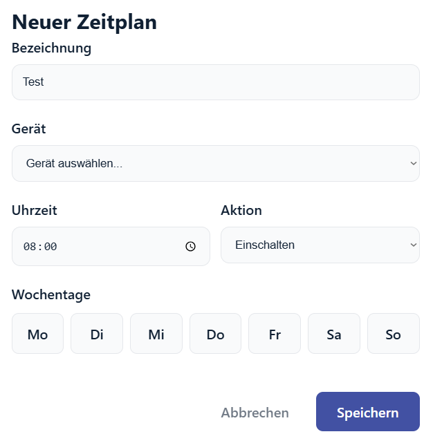

#### Regel-Engine
Die Anwendung stellt eine Regel-Engine bereit, die Regeln im Format „WENN … DANN …“ auswertet. ([FR-10](#fr-10), [FR-11](#fr-11), [FR-12](#fr-12), [FR-15](#fr-15))

Auch das Erstellen, Bearbeiten und Löschen von Regeln ist möglich.
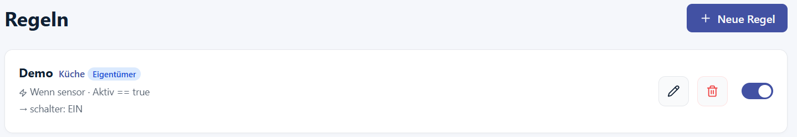

Bei der Erstellung einer Regel wird wieder ein Name vergeben. Anschließend wählt man ein Gerät und einen Zustand, der dann ein Ziel-Gerät beeinflusst.
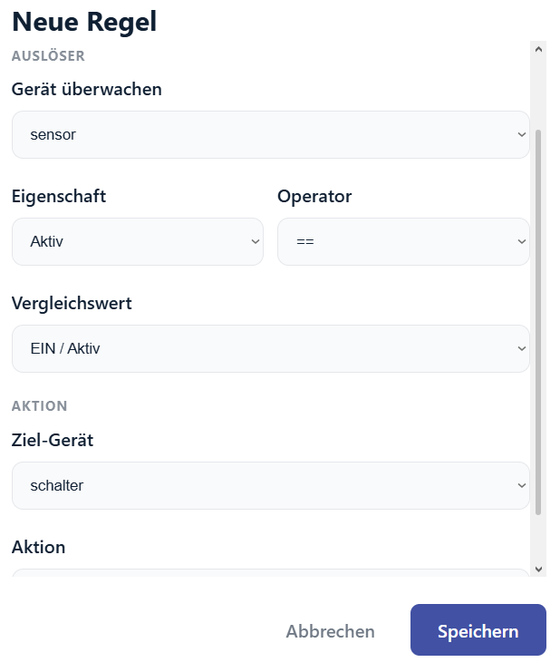

##### Benachrichtigung
Nachdem eine Regel ausgeführt wurde oder sie scheitert, erscheint ein Pop-up als Benachrichtigung.
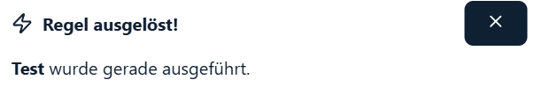

##### Planungskonflikt
Falls ein Konflikt zwischen zwei oder mehreren Regeln auftritt, wird dies direkt gemeldet, und die Regel kann nicht erstellt werden.
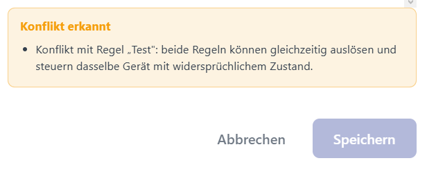

#### Szenen
Die Anwendung bietet eine Szenenfunktion zur Aktivierung benannter Gerätezustandsgruppen. ([FR-17](#fr-17))

Mit den Szenen können Geräte für bestimmte Ereignisse, wie einen Filmabend, direkt gesteuert werden. Diese kann man wieder erstellen, bearbeiten und löschen.
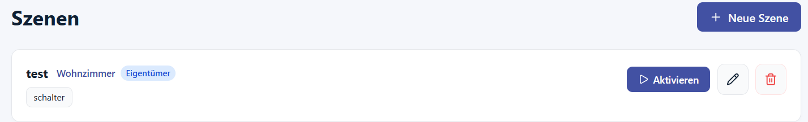

Beim Erstellen wird ein Name und eine optionale Beschreibung vergeben. Anschließend wählt man den betroffenen Raum und die dazugehörigen Geräte aus und setzt den Zustand dieser.
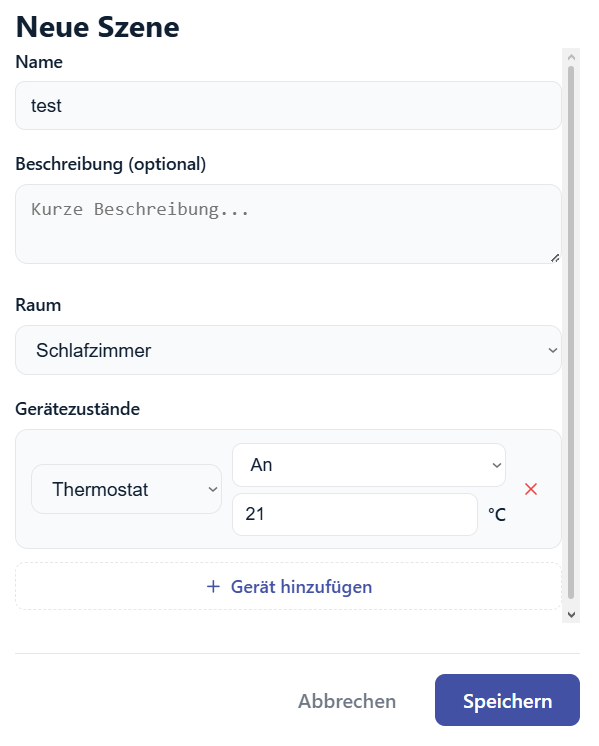

#### Urlaubsmodus
Benutzer können einen Urlaubsmodus aktivieren, der automatisch einen definierten Zeitplan für einen festgelegten Zeitraum anwendet. ([FR-21](#fr-21))

Der Urlaubsmodus kann unter den Einstellungen gefunden werden. Aktuelle Zeitpläne werden aufgrund einer Abwesenheit überschrieben. Bei der Erstellung wird der betroffene Raum vergeben, eine optionale Szene, die den gewünschten Stand eventuell bereits abdeckt, der Zeitraum der Abwesenheit und eine Aktivierungszeit.
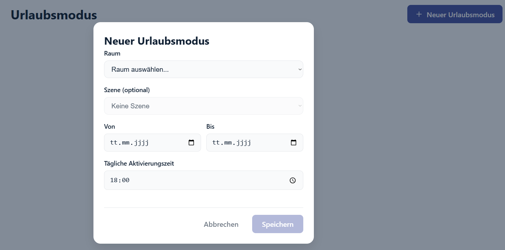

Dieser kann anschließend wieder bearbeitet, gelöscht oder deaktiviert werden.
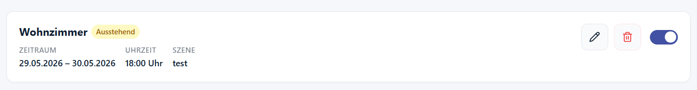

### Energie, Simulation und Integration

#### Energie-Dashboard
Der geschätzte Stromverbrauch wird pro Gerät, pro Raum und insgesamt aggregiert nach Tag und Woche angezeigt. ([FR-14](#fr-14))

Beim Start der Anwendung wird man direkt an das Energie-Dashboard geleitet, um einen Überblick über die aktuellen Geräte zu erhalten.
Angezeigt werden der Verbrauch der jeweiligen Räume, ein durchschnittlicher Verlauf pro Tag oder Woche und eine Übersicht der Geräte mit deren Verbrauch und den aktuellen Gerätestatus.
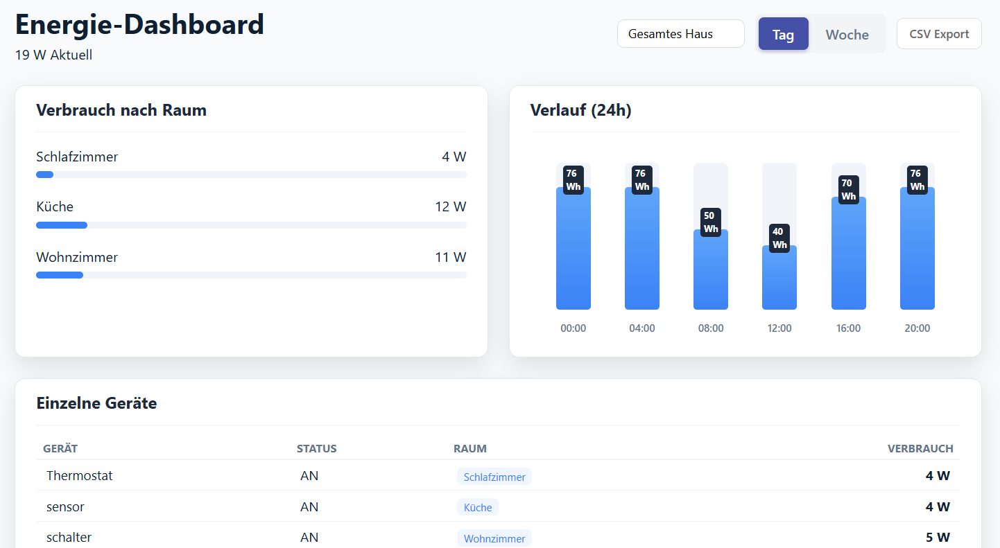

Einerseits kann das gesamte Haus, aber auch einzelne Räume oder Geräte sowie die Aggregation zwischen Tag oder Woche dargestellt werden.
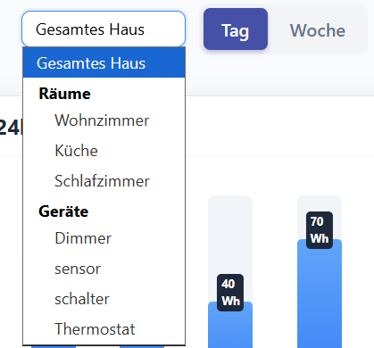

#### Simulation
Benutzer können einen vollständigen Tag simulieren, inklusive initialer Sensorwerte, Startzeit und aktiver Regeln. ([FR-19](#fr-19))

Im Simulator können entweder einzelne Wochentage oder eine gesamte Woche simuliert werden. Nach dem Start werden die unterschiedlichen automatisierten Zustandsänderungen in der darunterliegenden Raumübersicht farblich dargestellt. Die Simulation kann auch pausiert und zurückgesetzt werden.
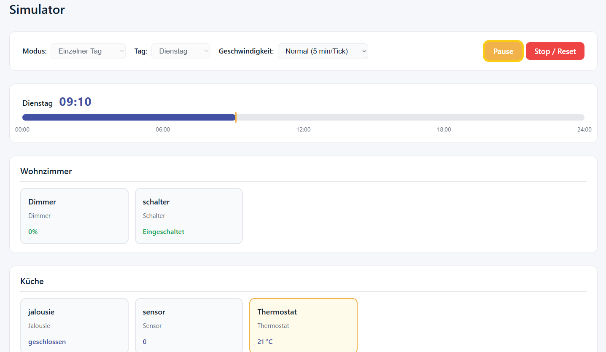

#### IoT-Integration
Eine optionale Integrationsschicht für physische IoT-Protokolle, zum Beispiel MQTT, wird unterstützt. ([FR-18](#fr-18))

Diese ist unter den Einstellungen zu finden.
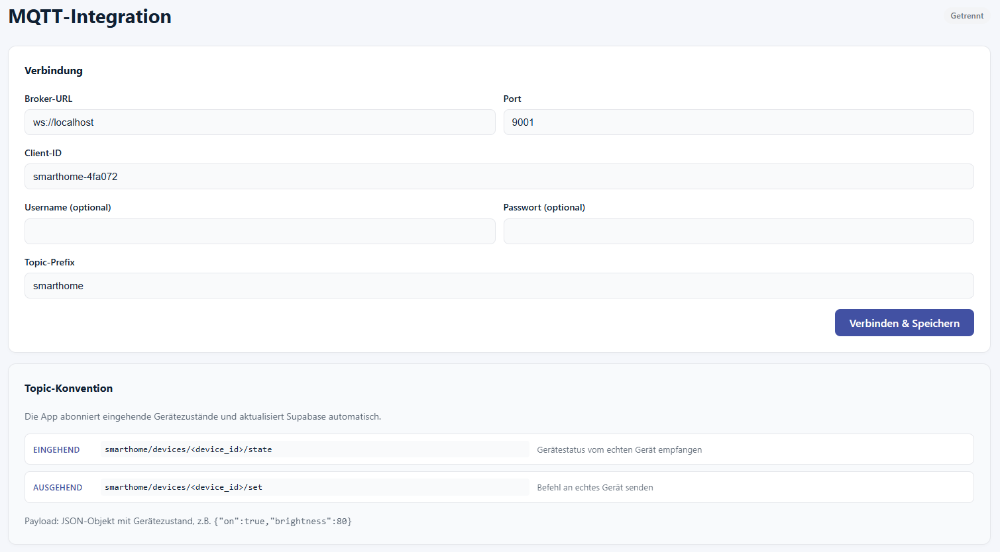

## Referenz auf die funktionalen Anforderungen

### FR-01
Das System soll es einem Benutzer ermöglichen, sich mit einer eindeutigen E-Mail-Adresse und einem Passwort zu registrieren.

### FR-02
Das System soll es einem registrierten Benutzer ermöglichen, sich sicher ein- und auszuloggen.

### FR-03
Das System soll es authentifizierten Benutzern ermöglichen, Räume zu erstellen, umzubenennen und zu löschen.

### FR-04
Das System soll es Benutzern ermöglichen, virtuelle Smart-Geräte einem Raum hinzuzufügen, mit Angabe von Typ und Name.

### FR-05
Das System soll es Benutzern ermöglichen, vorhandene Geräte zu entfernen oder umzubenennen.

### FR-06
Das System soll es Benutzern ermöglichen, ein Gerät manuell zu steuern.

### FR-07
Das System soll den aktuellen Zustand jedes Geräts in der Benutzeroberfläche in Echtzeit pflegen und anzeigen.

### FR-08
Das System soll für jede manuelle oder automatisierte Zustandsänderung einen Aktivitätslog-Eintrag erfassen.

### FR-09
Das System soll es Benutzern ermöglichen, bedingungslose zeitbasierte Zeitpläne für Geräteaktionen zu konfigurieren.

### FR-10
Das System soll eine Regel-Engine bereitstellen, die Bedingungs-Aktions-Regeln auswertet.

### FR-11
Das System soll mindestens drei Auslösertypen für Regeln unterstützen.

### FR-12
Das System soll den Benutzer über Regelereignisse informieren.

### FR-13
Das System soll zwei Benutzerrollen unterstützen.

### FR-14
Das System soll ein Energieverbrauchs-Dashboard anzeigen.

### FR-15
Das System soll Planungskonflikte erkennen und den Benutzer warnen.

### FR-16
Das System soll es Benutzern ermöglichen, Aktivitätslog und Energieverbrauchszusammenfassung als CSV-Datei zu exportieren.

### FR-17
Das System soll eine Szenen-Funktion bereitstellen.

### FR-18
Das System soll eine optionale Integrationsschicht für ein physisches IoT-Protokoll unterstützen.

### FR-19
Das System soll es Benutzern ermöglichen, einen vollständigen Tag zu simulieren.

### FR-20
Das System soll es dem Eigentümer ermöglichen, weitere Mitglieder per E-Mail-Adresse einzuladen und deren Zugang jederzeit zu widerrufen.

### FR-21
Das System soll es Benutzern ermöglichen, einen Urlaubsmodus zu aktivieren.
